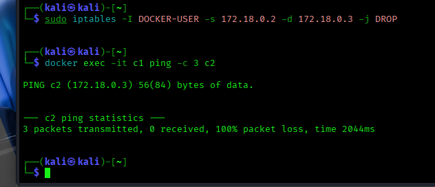

# Day 17 – Docker Networking: Packet Filtering & Firewalls

Today I learned how Docker uses iptables to manage container traffic and how to control inter-container communication.

## 🔑 Key Takeaways

- Docker sets up NAT and forwarding rules automatically for container traffic.
- The DOCKER-USER chain is where you can safely add custom firewall rules without being overridden.
- Blocking traffic between containers is possible with iptables:
- Ping succeeds normally.
- Ping fails when a DROP rule is added.
- Removing the rule restores connectivity.

## 🛠️ Commands Used
```bash
docker network create mynet
docker run -dit --name c1 --network mynet alpine sh
docker run -dit --name c2 --network mynet alpine sh
docker exec -it c1 apk add --no-cache iputils
docker exec -it c2 apk add --no-cache iputils
docker exec -it c1 ping -c 3 c2
sudo iptables -I DOCKER-USER -s <c1_ip> -d <c2_ip> -j DROP
docker exec -it c1 ping -c 3 c2   # fails now
sudo iptables -D DOCKER-USER -s <c1_ip> -d <c2_ip> -j DROP
docker exec -it c1 ping -c 3 c2   # works again
```
